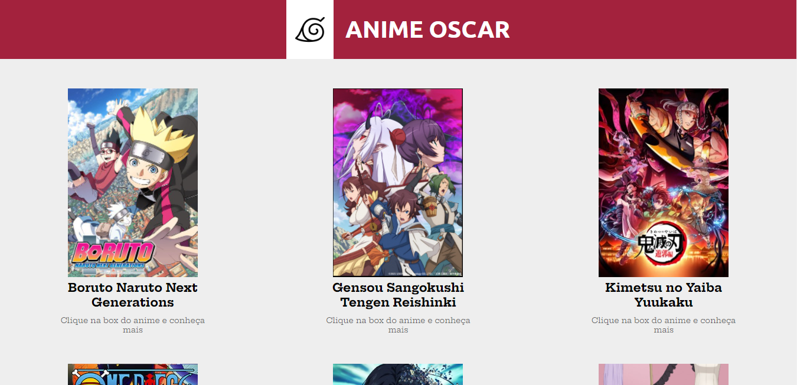
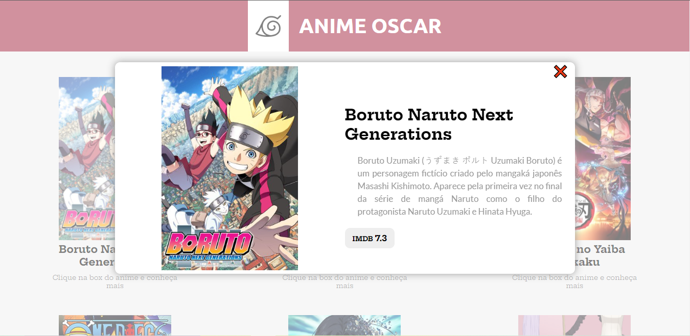

# Projeto-Javascript

Projeto feito com JavaScript puro. O arquivo anime.js contém as informações dos animes listados e o script.js faz a chamada desse arquivo.

  ##
  

  
  
  

  
  ##
  [Link para o site](https://kalebes1.github.io/Projeto-Javascript/)
  
